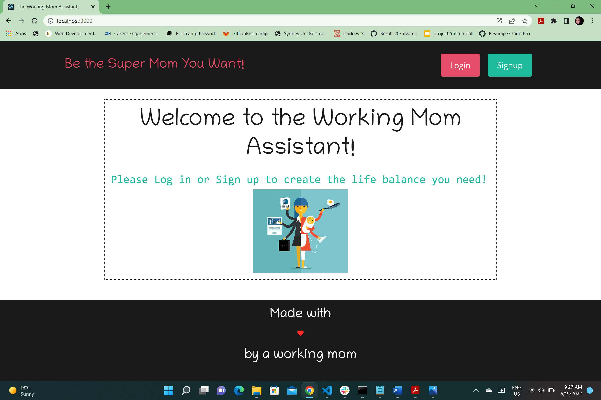
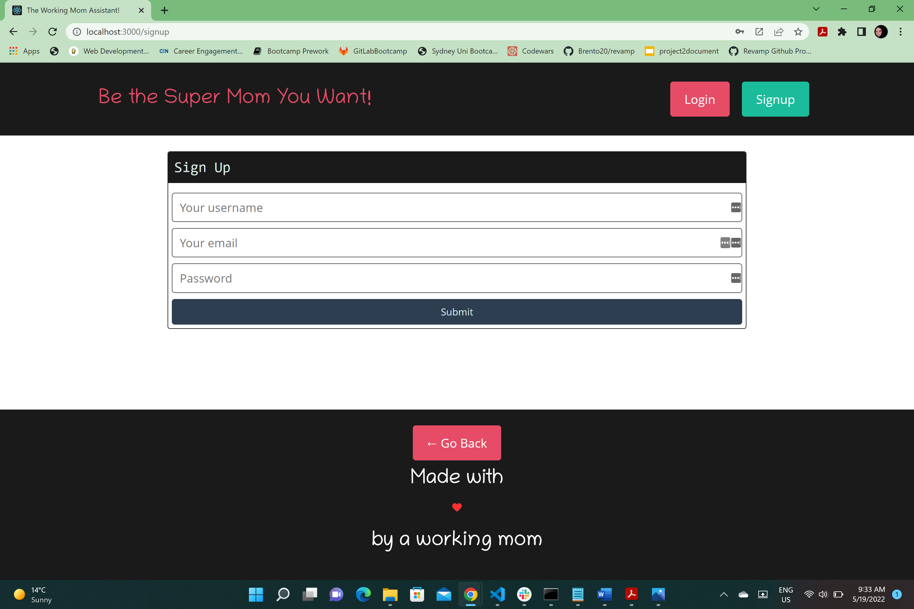
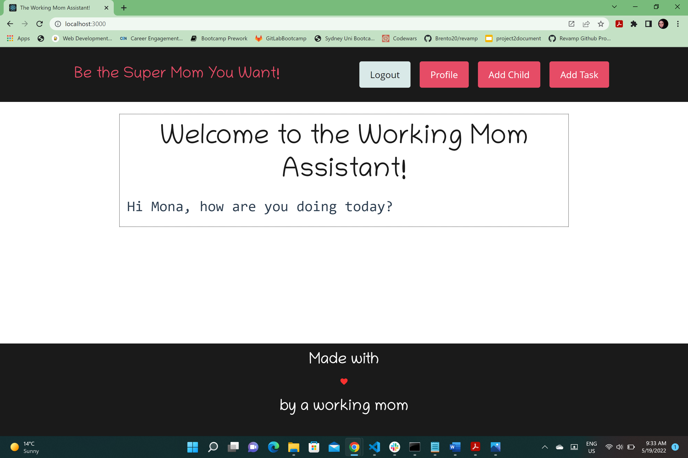
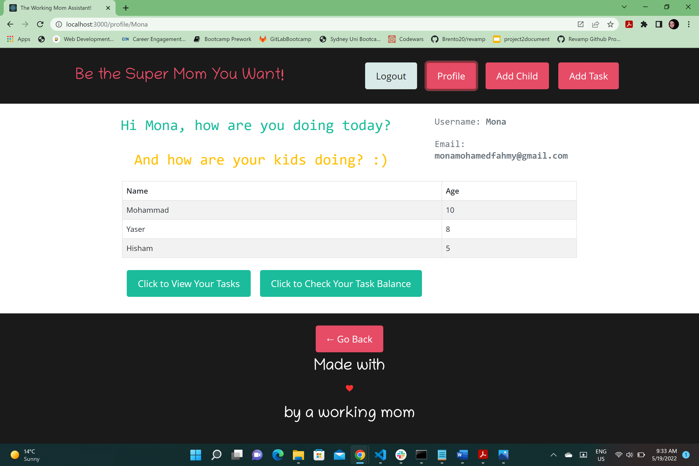
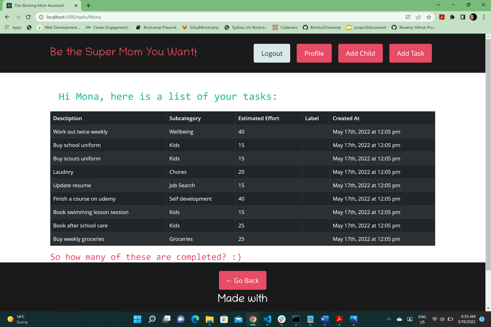
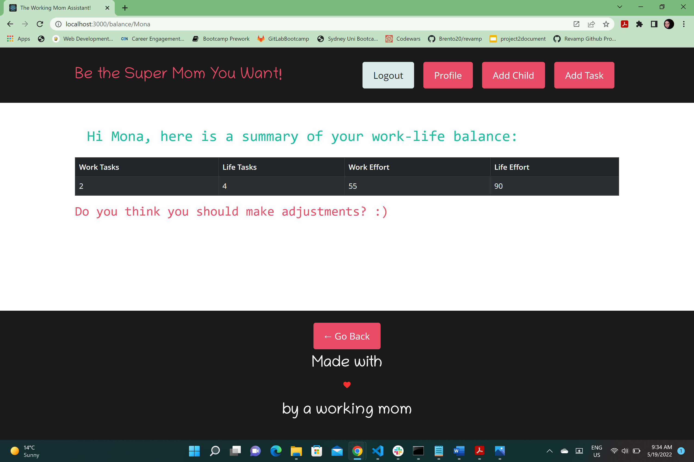
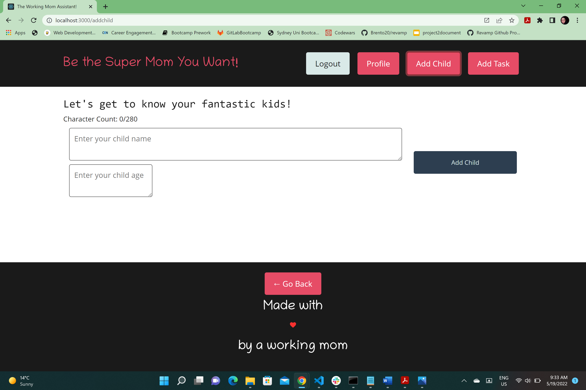
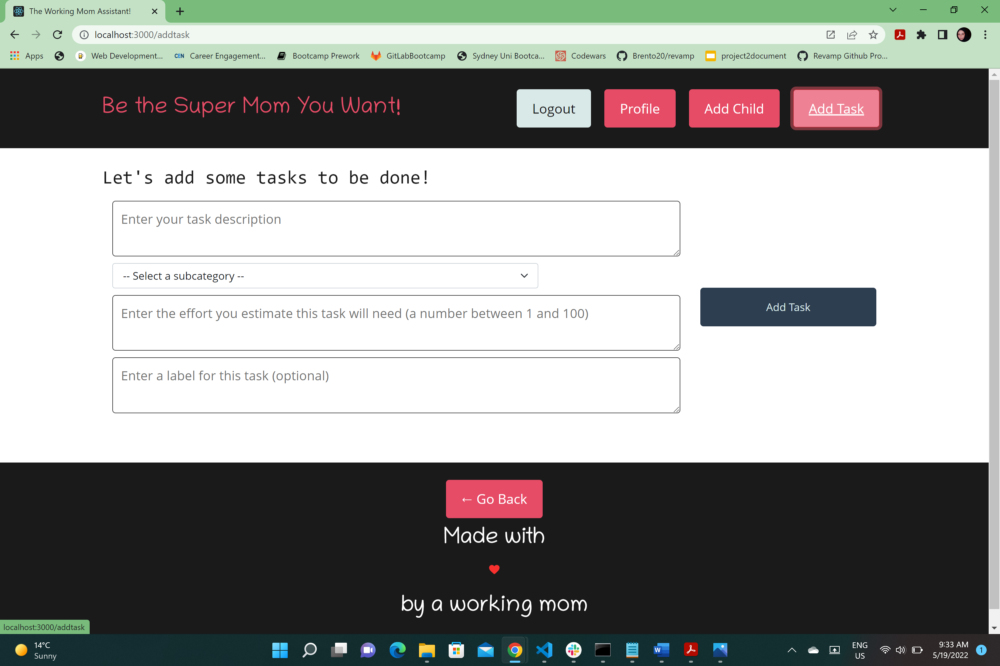
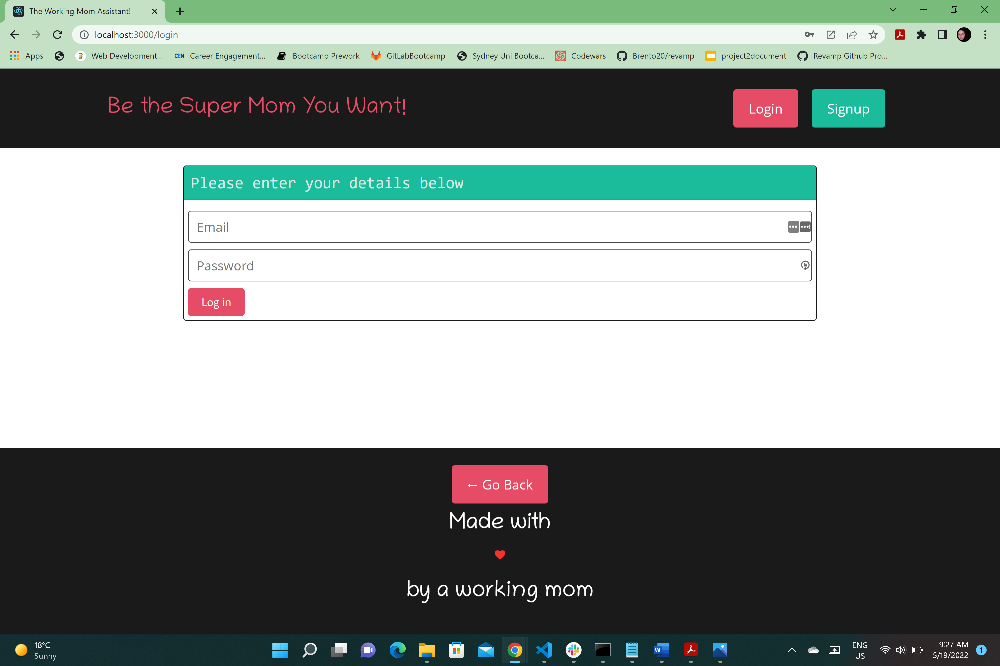

# The Working Mom Assistant

## Description

The working mom assistant is a web application developed to help working moms achieve work life balance and reach their maximum potential in life. I provides features to organize tasks and measure effort spent on different categories.

## Table of Contents 

- [Installation](#installation)
- [Usage](#usage)
- [Credits](#credits)
- [License](#license)

## Installation

Please visit the web site from this link: https://working-mom-assistant.herokuapp.com/
You will need to sign up to explore the application helpful features.

## Usage

Upon opening the site you will be greated by the following screen: 
  

  

Through clicking on the Sign Up button you will be able to sign up by providing your details to this screen:
  

After signing up you will be automatically logged in and redirected to homepage
  

Then you can view your profile data by clicking on the profile button in the header. The info of any children added to your profile will be displayed there as well.
  

From profile page you can view tasks you added before by clicking the button that says "Click To View Your Tasks". The tasks will be loaded like this:
  

You can also click on the 'Click to Check Your Task Balance' button to tell you inforamtion helpful to check your work life balance.
  

You can add a child or a task by clicking on the corresponding button from the header. Each button will show a form to fill the info.
  

If you log out at anytime you can log in again by clicking on log in button and entering your details.
  

